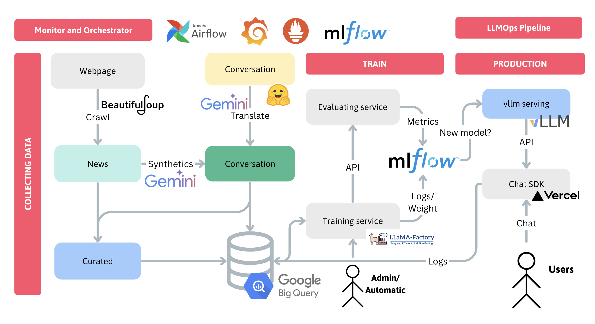

# LLMOps Pipeline: NEU_SOLUTION

<!-- ABOUT THE PROJECT -->
## About The Project

This project implements an end-to-end LLMOps pipeline to manage the lifecycle of a large language model (LLM) deployment. It encompasses data collection, data curation, synthetic data generation, model training, evaluation, and production serving using multiple tools and services. The pipeline is designed to automate data processing, model evaluation, and deployment, ensuring a scalable and maintainable infrastructure for large language model applications.

<!-- ARCHITECTURE -->
## ARCHITECTURE

The pipeline consists of the following components:

1. **Data Collection**

Web Scraping: Web data is collected using BeautifulSoup to crawl news and other relevant data.

Synthetics Generation: Gemini is employed to generate synthetic data for conversational use cases.

See crawl

2. **Data Curation**

Data collected from scraping and synthetic generation is aggregated and stored in Google BigQuery for further processing and analysis.

3. **Monitoring and Orchestration**

Apache Airflow orchestrates the entire data collection, processing, and training workflow.

Prometheus and Grafana are used for monitoring metrics and visualizing data.

4. **Model Training**

LLaMA-Factory is used to fine-tune the LLM using curated data and synthetic conversations.
Training data is sourced from BigQuery and fed into the training pipeline.
MLflow manages model tracking, logging, and storing training weights and metrics.
See training_cluster

5. **Model Evaluation**

An evaluation service assesses the model's performance based on specific metrics defined in MLflow.

The results of the evaluation determine whether the new model will be deployed.

See evaluating_cluster

6. **Production Serving**

The trained model is deployed using vLLM, a serving framework optimized for LLM inference.

The API endpoints are exposed for interaction through a Chat SDK implemented using Vercel.

See production_cluster

7. **User Interaction**

End users interact with the deployed model through the Chat SDK, receiving responses generated by the LLM.

### Built With

This section should list any major frameworks/libraries used to bootstrap your project. Leave any add-ons/plugins for the acknowledgements section. Here are a few examples.

* [![Str][Streamlit]][Streamlit-url]
* ![bucket][S3]
* ![db][RDS]
* ![instace][EC2]
* ![embedding][OPENAI]
* ![llm][claude]
* ![dbms][pg]

<!-- LOGO LINKS -->
[Streamlit-logo]: https://upload.wikimedia.org/wikipedia/commons/1/1e/Streamlit_logo.png
[S3-logo]: https://upload.wikimedia.org/wikipedia/commons/0/0e/Amazon_S3_logo.svg
[RDS-logo]: https://upload.wikimedia.org/wikipedia/commons/2/24/Amazon_RDS_Logo.png
[EC2-logo]: https://upload.wikimedia.org/wikipedia/commons/f/fd/Amazon_Web_Services_Logo.svg
[OpenAI-logo]: https://upload.wikimedia.org/wikipedia/commons/4/4b/OpenAI_Logo.svg
[Claude-logo]: https://upload.wikimedia.org/wikipedia/commons/e/e9/Anthropic_logo.png
[PostgreSQL-logo]: https://upload.wikimedia.org/wikipedia/commons/2/29/Postgresql_elephant.svg

<!-- URL LINKS -->
[Streamlit-url]: https://streamlit.io/
